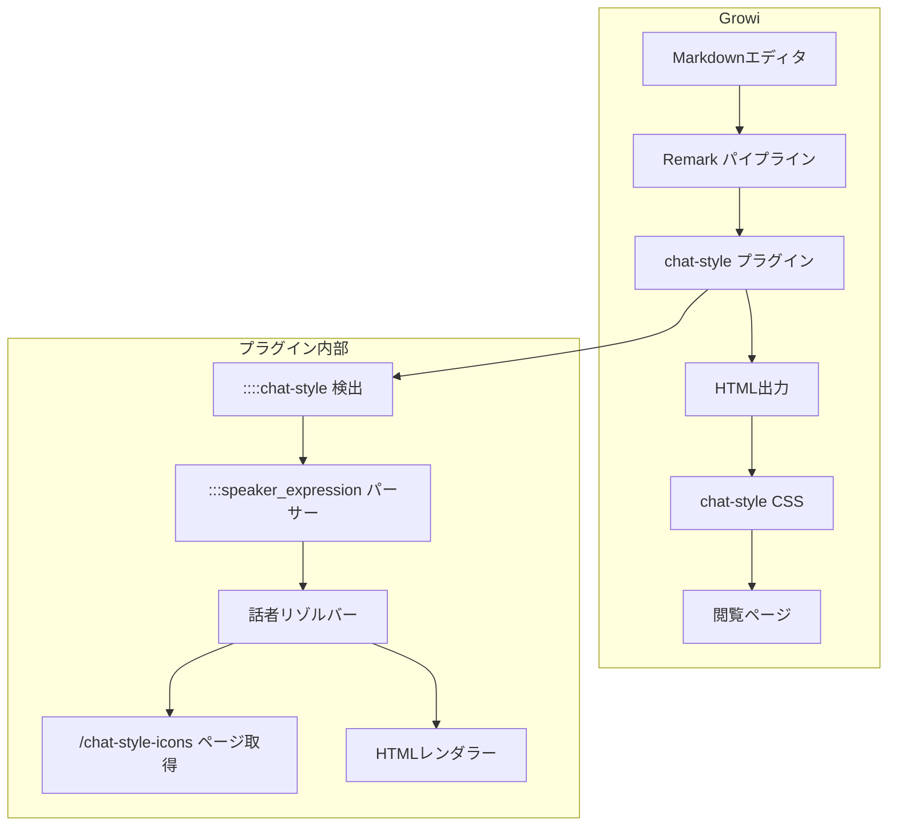
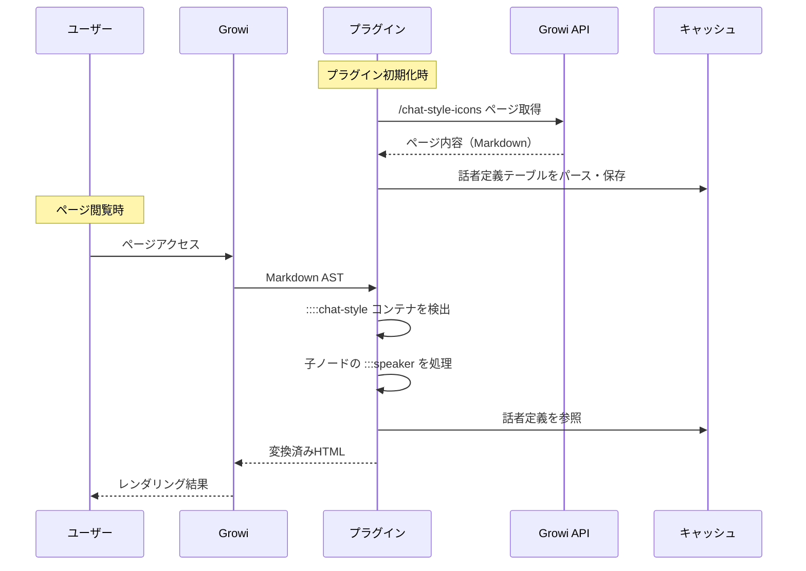
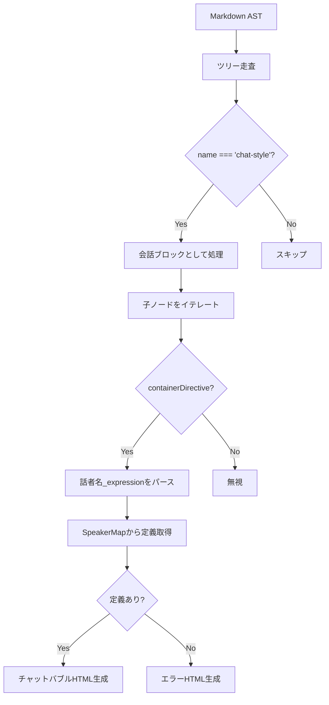
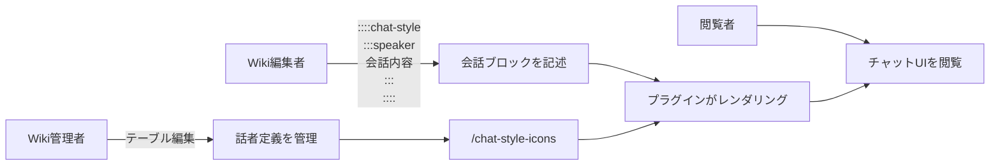

# 機能設計書

## 1. システム構成図



## 2. アーキテクチャ

### 2.1 プラグインの動作フロー



### 2.2 処理の2段階

1. **話者定義の取得・キャッシュ**（非同期・初期化時）
   - プラグインの `activate()` 時に `/chat-style-icons` ページをGrowiのAPIで取得
   - テーブルをパースして話者定義マップとしてモジュール変数にキャッシュ
   - キャッシュは一定時間（5分）で失効し、次回レンダリング時に再取得

2. **Markdown変換**（同期・レンダリング時）
   - remarkプラグインが `containerDirective` ノードを走査
   - `name === 'chat-style'` のコンテナノードを検出（`::::chat-style`）
   - その子ノードの中から `containerDirective` を探し、話者記法として処理
   - `::::chat-style` 外の `containerDirective` は処理対象外（スキップ）

### 2.3 AST処理の詳細



remark-directiveのネスト仕様:
- `::::` (コロン4つ) → 外側のコンテナ（`containerDirective`, `name: "chat-style"`）
- `:::` (コロン3つ) → 内側のコンテナ（`containerDirective`, `name: "speaker_expression"`）
- 外側コンテナの `children` 配列に内側コンテナがネストされる

## 3. データモデル定義

### 3.1 話者定義（SpeakerDefinition）

```typescript
interface SpeakerDefinition {
  speaker: string;       // 話者名（例: "claude-bot"）
  expression: string;    // 表情（例: "smiling", "default"）
  iconUrl: string;       // アイコン画像URL（Markdown画像記法からsrcを抽出）
  position: 'left' | 'right';  // 配置
}
```

### 3.2 話者定義マップ（SpeakerMap）

```typescript
// キー: "話者名_expression" （例: "claude-bot_smiling"）
type SpeakerMap = Map<string, SpeakerDefinition>;
```

### 3.3 テーブルパース対象

`/chat-style-icons` ページのMarkdownテーブル:

```markdown
| 話者 | expression | アイコン | 配置 |
|------|-----------|---------|------|
| claude-bot | default |  | left |
| claude-bot | smiling |  | left |
| me | default |  | right |
```

パース処理:
1. テーブル行をイテレート
2. 「アイコン」列の `` から画像URLを正規表現で抽出
3. `SpeakerMap` に `話者_expression` をキーとして格納

## 4. コンポーネント設計

### 4.1 ファイル構成

```
src/
├── client-entry.tsx          # プラグインエントリーポイント
├── plugin.ts                 # remarkプラグイン本体
├── speaker-resolver.ts       # 話者定義の取得・パース・キャッシュ
├── node-transformer.ts       # ASTノード変換（hName設定・子ノード挿入）
└── styles/
    └── chat-style.css        # チャットバブルCSS
```

### 4.2 各コンポーネントの責務

#### client-entry.tsx
- プラグインの `activate()` を定義
- `remarkPlugins` への登録（viewOptions, previewOptions 両方）
- 話者定義の初期取得をトリガー
- CSSの注入

#### plugin.ts
- remarkプラグインとして `containerDirective` ノードを走査
- `name === 'chat-style'` のノードを会話ブロックとして認識
- 会話ブロックの子ノードのみを話者記法として処理（ブロック外はスキップ）
- 話者ノード名を `speaker_expression` 形式でパース
- `speaker-resolver` から話者情報を取得
- **`node.data.hName` 方式でHTML要素を指定**し、子ノード（会話テキスト）はGrowiの標準パイプラインに委譲
- アイコン・話者名は子ノード先頭にHTMLノードとして挿入

#### speaker-resolver.ts
- `/chat-style-icons` ページのAPI取得
- Markdownテーブルのパース
- `SpeakerMap` のキャッシュ管理（TTL: 5分）
- 話者の検索・未定義時のエラー情報返却

#### node-transformer.ts
- `SpeakerDefinition` に基づきASTノードに `data.hName` / `data.hProperties` を設定
- アイコン・話者名のHTMLノードを子ノードに挿入
- 左配置・右配置のクラス名分岐
- エラーメッセージのHTMLノード生成

#### styles/chat-style.css
- 会話ブロックコンテナのスタイル
- チャットバブルのスタイル定義
- レスポンシブ対応

## 5. ユースケース図



## 6. 画面遷移図・ワイヤフレーム

### 6.1 ページ全体のイメージ

```
┌──────────────────────────────────────────────────┐
│ # ドキュメントタイトル                             │
│                                                  │
│ 通常のMarkdownテキスト...                          │
│                                                  │
│ ┌──────────────────────────────────────────────┐ │
│ │ chat-style-container                         │ │
│ │                                              │ │
│ │  ┌──────┐  claude-bot                        │ │
│ │  │ icon │  ┌────────────────────┐            │ │
│ │  └──────┘  │ 会話内容1          │            │ │
│ │            └────────────────────┘            │ │
│ │                                              │ │
│ │                       me  ┌──────┐           │ │
│ │      ┌────────────────────┐│ icon │           │ │
│ │      │ 会話内容2          ││      │           │ │
│ │      └────────────────────┘└──────┘           │ │
│ │                                              │ │
│ └──────────────────────────────────────────────┘ │
│                                                  │
│ 通常のMarkdownに戻る...                            │
│                                                  │
└──────────────────────────────────────────────────┘
```

### 6.2 チャットバブル レイアウト

```
左配置（相手側）:
┌──────────────────────────────────────────────────┐
│  ┌──────┐  話者名                                │
│  │ icon │  ┌──────────────────────────┐          │
│  │      │  │ 会話内容テキスト         │          │
│  └──────┘  │ **太字**もOK            ◄─┐         │
│            └──────────────────────────┘  │        │
│                                     吹き出しの尻尾│
└──────────────────────────────────────────────────┘

右配置（自分側）:
┌──────────────────────────────────────────────────┐
│                                話者名  ┌──────┐  │
│          ┌──────────────────────────┐  │ icon │  │
│          │ 会話内容テキスト         │  │      │  │
│      ┌─►│ リンクも使える          │  └──────┘  │
│      │  └──────────────────────────┘             │
│ 吹き出しの尻尾                                   │
└──────────────────────────────────────────────────┘
```

### 6.3 エラー表示

```
┌──────────────────────────────────────────────────┐
│  ┌─────────────────────────────────────────────┐ │
│  │ ⚠ [chat-style error]                       │ │
│  │ 話者 "unknown" は /chat-style-icons に      │ │
│  │ 定義されていません                           │ │
│  └─────────────────────────────────────────────┘ │
└──────────────────────────────────────────────────┘
```

## 7. 生成HTML構造とAST変換の対応

### 7.1 AST変換方式

本プラグインでは `node.data.hName` / `node.data.hProperties` 方式を採用する。
子ノード（会話テキスト内のMarkdown）はGrowiの標準パイプラインがレンダリングする。

### 7.2 会話ブロック全体

AST変換:
```typescript
// ::::chat-style ノード
node.data = { hName: 'div', hProperties: { className: ['chat-style-container'] } };
// → 子ノード（:::speaker バブル群）はそのまま保持
```

出力HTML:
```html
<div class="chat-style-container">
  <!-- 内側の各バブルがここに配置される -->
</div>
```

### 7.3 左配置

AST変換:
```typescript
// :::claude-bot_smiling ノード
node.data = { hName: 'div', hProperties: { className: ['chat-style-bubble', 'chat-style-left'] } };
// 子ノード先頭にアイコン・話者名HTMLを挿入
node.children.unshift({
  type: 'html',
  value: '<div class="chat-style-avatar"></div>'
});
node.children.unshift({
  type: 'html',
  value: '<div class="chat-style-speaker-name">claude-bot</div>'
});
// 既存の子ノード（会話テキスト）はGrowiが標準レンダリング
```

出力HTML:
```html
<div class="chat-style-bubble chat-style-left">
  <div class="chat-style-avatar">
    
  </div>
  <div class="chat-style-speaker-name">claude-bot</div>
  <p>会話内容テキスト（Growiが標準レンダリング）</p>
</div>
```

### 7.4 右配置

AST変換:
```typescript
// :::me ノード（expression省略 → default）
node.data = { hName: 'div', hProperties: { className: ['chat-style-bubble', 'chat-style-right'] } };
// 子ノード末尾にアイコンHTMLを追加
node.children.push({
  type: 'html',
  value: '<div class="chat-style-avatar"></div>'
});
```

出力HTML:
```html
<div class="chat-style-bubble chat-style-right">
  <div class="chat-style-speaker-name">me</div>
  <p>会話内容テキスト（Growiが標準レンダリング）</p>
  <div class="chat-style-avatar">
    
  </div>
</div>
```

### 7.5 エラー（未定義話者）

エラーの場合は子ノードの保持が不要なため、`node.type = 'html'` で直接置換する:

```typescript
node.type = 'html';
node.value = '<div class="chat-style-error">⚠ [chat-style error] 話者 "unknown" は /chat-style-icons に定義されていません</div>';
node.children = [];
```

出力HTML:
```html
<div class="chat-style-error">
  ⚠ [chat-style error] 話者 "unknown" は /chat-style-icons に定義されていません
</div>
```

## 8. CSS設計

### 8.1 主要クラス

| クラス名 | 用途 |
|---------|------|
| `.chat-style-container` | 会話ブロック全体のラッパー（背景・パディング） |
| `.chat-style-bubble` | バブル全体のコンテナ（flexbox） |
| `.chat-style-left` | 左配置の修飾子 |
| `.chat-style-right` | 右配置の修飾子 |
| `.chat-style-avatar` | アイコン画像のコンテナ |
| `.chat-style-icon` | アイコン画像（丸型、40x40px） |
| `.chat-style-content` | 話者名＋メッセージのコンテナ |
| `.chat-style-speaker-name` | 話者名テキスト |
| `.chat-style-message` | 吹き出し本体（角丸、影、尻尾付き） |
| `.chat-style-error` | エラーメッセージ |

### 8.2 CSS変数設計（テーマ対応）

2層のCSS変数構造で、Growiのlight/darkテーマに自動追従する。

#### 第1層: Bootstrap標準変数（Growiが提供）
Growiが `[data-bs-theme="light"]` / `[data-bs-theme="dark"]` に応じて切り替える変数を利用する。

#### 第2層: プラグイン固有変数（`--chat-style-*`）
Bootstrap変数を参照してプラグイン用の色を定義する。右吹き出し（LINE風緑）のみ独自色を使用。

```css
:root, [data-bs-theme="light"] {
  --chat-style-container-bg: var(--bs-tertiary-bg);       /* コンテナ背景 */
  --chat-style-left-bg: var(--bs-secondary-bg);           /* 左吹き出し背景 */
  --chat-style-left-color: var(--bs-body-color);          /* 左吹き出し文字色 */
  --chat-style-right-bg: #8de88b;                         /* 右吹き出し背景（LINE風緑） */
  --chat-style-right-color: #1a3a1a;                      /* 右吹き出し文字色 */
  --chat-style-speaker-color: var(--bs-secondary-color);  /* 話者名 */
  --chat-style-icon-bg: var(--bs-secondary-bg);           /* アイコン背景 */
  --chat-style-error-bg: var(--bs-danger-bg-subtle);      /* エラー背景 */
  --chat-style-error-border: var(--bs-danger-border-subtle);
  --chat-style-error-color: var(--bs-danger-text-emphasis);
}
[data-bs-theme="dark"] {
  --chat-style-right-bg: #2d6a2e;                         /* ダーク用緑 */
  --chat-style-right-color: #d4f5d4;
  /* 他はBootstrap変数の参照先が自動で切り替わるため定義不要 */
}
```

#### テーマ対応の利点
- Growiのテーマ切り替えに自動追従（プラグイン側の追加処理不要）
- `--chat-style-*` をユーザーがカスタムCSSで上書き可能
- `prefers-color-scheme` にも対応（BootstrapがOSの設定を反映する場合）

### 8.3 スタイル方針

- `.chat-style-container`: `var(--chat-style-container-bg)` で背景色指定、パディング、角丸で通常コンテンツと視覚的に区別
- 吹き出しの背景色: 左=テーマの`secondary-bg`、右=LINE風緑（テーマで明度調整）
- アイコン: 丸型（`border-radius: 50%`）、40x40px
- 吹き出しの尻尾: CSS疑似要素（`::before`）で三角形を描画
- レスポンシブ: `max-width: 70%` で吹き出し幅を制限、モバイルでは `max-width: 85%`
- メッセージ間余白: `margin-bottom: 16px`

## 9. 記法パース仕様

### 9.1 ASTノードの対応関係

```
Markdown入力:
  ::::chat-style          → containerDirective (name: "chat-style")
  :::claude-bot_smiling     → containerDirective (name: "claude-bot_smiling") ※childrenに格納
  会話内容                    → paragraph ※さらにその children
  :::                       → (コンテナ終了)
  ::::                    → (コンテナ終了)

AST構造:
  containerDirective {
    name: "chat-style",
    children: [
      containerDirective {
        name: "claude-bot_smiling",
        children: [
          paragraph { children: [text { value: "会話内容" }] }
        ]
      },
      containerDirective {
        name: "me",
        children: [
          paragraph { children: [text { value: "返答" }] }
        ]
      }
    ]
  }
```

### 9.2 ノード名の分解ルール

```
入力: containerDirective の name プロパティ
パターン: {speaker}_{expression} または {speaker}

例:
  "claude-bot_smiling" → speaker="claude-bot", expression="smiling"
  "me_default"         → speaker="me",         expression="default"
  "me"                 → speaker="me",         expression="default"
  "admin_angry"        → speaker="admin",      expression="angry"
```

分解ロジック:
1. 最後の `_` で分割を試みる
2. 分割結果の話者名がSpeakerMapに存在するか確認
3. 存在しなければノード名全体を話者名、expressionを `default` とする
4. いずれにも該当しなければエラー

### 9.3 パース優先順位

`a_b_c` のようなノード名の場合:
1. まず `speaker="a_b"`, `expression="c"` で検索
2. 見つからなければ `speaker="a_b_c"`, `expression="default"` で検索
3. いずれも未定義ならエラー

> 話者名にアンダースコアを含むケースに対応するため、最後の `_` で分割する。
